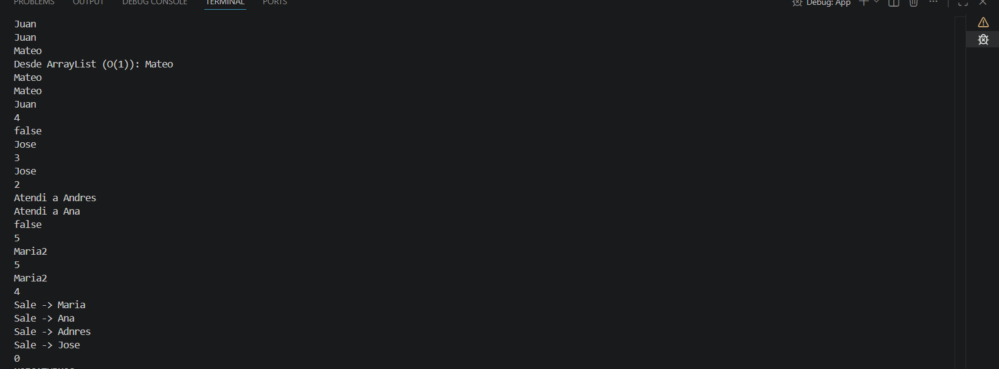
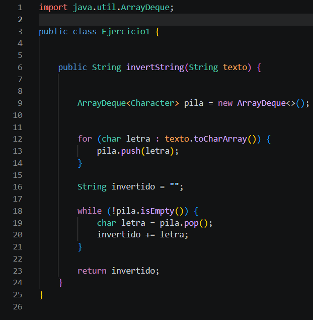

# Práctica: Estructuras Dinámicas Lineales

## Datos del Estudiante
- **Nombre:** Jose Adrian Plaza Salto
- **Curso:** Grupo 3
- **Fecha:** 08/06/2026

---

## 1. Implementación de estructuras dinámicas lineales

**Fecha:** 08/06/2026

**Descripción:**
Consiste en invertir una cadena de texto aprovechando la propiedad LIFO (Last In, First Out) de una pila. El algoritmo recorre el texto carácter por carácter y los guarda en la pila usando push(). Al extraerlos con pop(), el último elemento en entrar es el primero en salir, lo que devuelve automáticamente el texto en orden inverso de forma muy eficiente ($O(N)$).


### Captura de salida en consola



### Captura del código de implementación del ejercicio 1



o bloque de código .


## 2. Ejercicio Palíndromo

**Fecha:** 09/06/2026

**Descripción:**
El ejercicio 2 consiste en verificar si una palabra es palíndroma (se lee igual de izquierda a derecha que de derecha a izquierda). Para lograrlo, se guardan todos los caracteres del texto en una pila y luego se extraen para generar la palabra invertida. Finalmente, se compara el texto original con el invertido; si son idénticos, el método determina que la palabra es palíndroma.

### Método implementado

````java
public boolean esPalindromo(String texto) {
    // Implementación del método
}